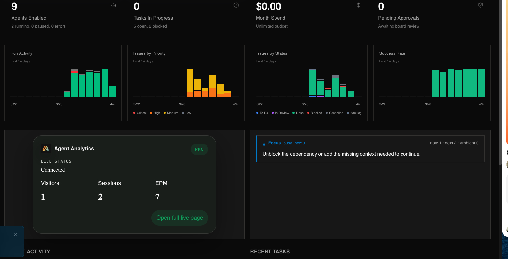

# Agent Analytics Live for Paperclip

Agent Analytics Live is the Paperclip plugin for operators who want live web activity where they already run the company.

It brings a company-level live monitor, a dashboard widget, and a sidebar entry into Paperclip so teams can answer one question quickly:

Which company asset is moving right now, and is that movement worth attention?

## Screenshot



## What ships in v1

- `page`: company-level live operator view
- `dashboardWidget`: compact live summary on the main dashboard
- `sidebar`: left-nav entry that opens the live page
- `settingsPage`: login-first auth, asset mapping, and rollout controls
- Worker-owned Agent Analytics auth, `/live` polling, `/stream` SSE fan-out, and company-scoped live cache

## Requirements

- An Agent Analytics account
- A Paperclip instance with plugin support
- Access to Agent Analytics live routes

Notes:

- `/stream` and `/live` are live routes, and `/live` is paid-only
- The plugin is intentionally a live monitor, not a historical reporting surface

Create or access your Agent Analytics account at [agentanalytics.sh](https://agentanalytics.sh).

## Install In Paperclip UI

1. In Paperclip, open `Settings` -> `Plugins`.
2. Click `Install Plugin`.
3. Paste this npm package name:

```text
@agent-analytics/paperclip-live-analytics-plugin
```

4. Click `Install`.
5. Open the plugin `Configure` page.

## Install By CLI

```bash
npx paperclipai plugin install @agent-analytics/paperclip-live-analytics-plugin
```

## First-Run Setup

1. Open the plugin `settingsPage`.
2. Click `Start login`.
3. Open the returned approval URL.
4. Sign in with Google or GitHub.
5. Paste the finish code into the settings page.
6. Let the worker validate `GET /projects` and start live sync.
7. Map your Paperclip assets to Agent Analytics projects and enable the surfaces you want to expose.

Full Paperclip company setup guide:

[Install and set up Agent Analytics for Paperclip](https://docs.agentanalytics.sh/guides/paperclip/)

## Docs

- [Operator overview](./docs/operator-overview.md)
- [Setup and auth](./docs/setup-auth.md)
- [Asset mapping guide](./docs/asset-mapping.md)
- [Live behavior](./docs/live-behavior.md)
- [Limits and troubleshooting](./docs/limits-and-troubleshooting.md)
- [Maintainer notes](./docs/MAINTAINER.md)

## Package Name

`@agent-analytics/paperclip-live-analytics-plugin`

## Development

```bash
npm install
npm test
npm run build
```

Helpful local commands:

```bash
npm run pack:local
npm run reinstall:local
```

`npm test` exercises the dependency-light worker/shared logic. `npm run build` builds the Paperclip worker and UI entrypoints defined in `package.json`.

## Files

- `paperclip-plugin.manifest.json`: Paperclip-facing manifest contract
- `src/worker/`: worker setup, auth, live polling, SSE fan-out, state persistence
- `src/ui/`: React surfaces for page, widget, and settings
- `docs/`: operator and maintainer docs shipped with the plugin
